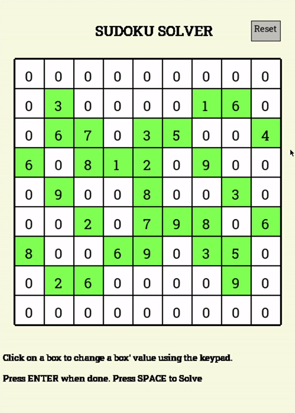

# SudokuSolver

A Visual Tool Displaying the Backtracking Sudoku solving algorithm

## GUI

Using Python's PyGame library, a responsive GUI was created.
## Features
Using this program, the User is able to:
 
* Set known Sudoku squares with mouse and keyboard
* Solve the Sudoku
* View the Sudoku being solved in real time
* Reset the board position
## Running Application

